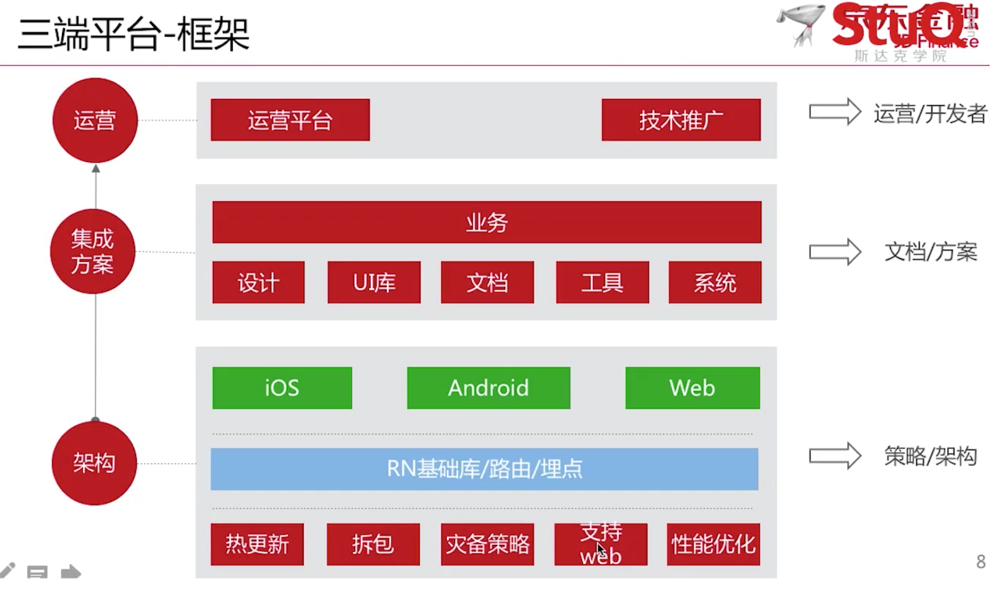
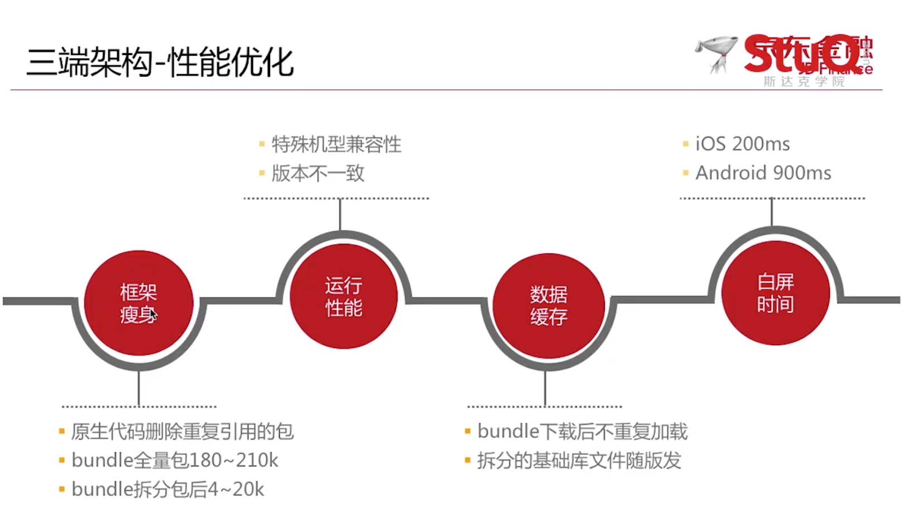
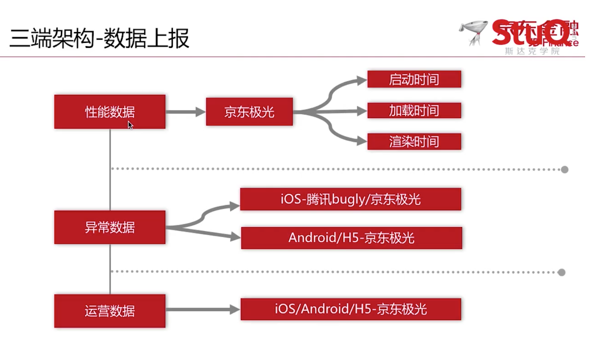
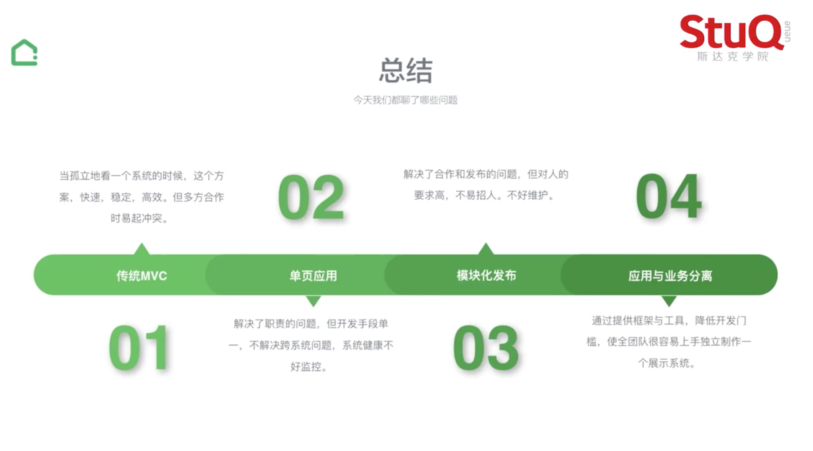

## 构建大型应用

分享人：孟红伦(钉钉)

### 重要的俩块

- 使用 `TypeScript` 解决代码 `复杂` ,数据模型的问题
- 使用 `RxJS` 更好的解决 `异步` 带来的问题

### 代码如何复杂

- 上百个 RPC 接口
- 几十种消息推送
- 10W + 行代码
- 模块依赖关系复杂
- 数据模型复杂

### 钉钉犯过的错

- 开发时没有考虑到个人用户登录时的 'org' 字段
- 因为开发环境中是 `归属某个企业` 的,忽视了对 `不归属任何企业的个人用户`的测试
- 最后还是用户主动反映了这个问题
- 问题责任:测试的锅

<!-- more -->

### 什么是 Typescript

- 它是 JS 的超集,兼容 ES5,ES2015/16/17.
- 它的编译结果是 JS , 可以运行在浏览器/Node 端.
- 它支持 TS 和 JS 混用

### 主流框架支持程度

- Angular 2.0 `完全支持`
- VUE 2.0 `部分支持`
  - 模板中还不具备 Type Check 的能力
- React `完全支持`
  - jsx 不是 '模板'而是 js,所以 Type Check 支持的很好

### 异步逻辑的处理

- `RxJS` 实现渐进式搜索
- 使用 Rx.js Observable 可以更好更直观的描述这些 API,帮助你在错综复杂的异步 API 调用中少犯错

---

## 项目中如何选择框架和库

分享人：张克军(豆瓣)

`特指`公司规模比较大,协作开发的人数比较多,商业型项目

### 商业型项目的核心

1.  注重以结果为导向
2.  高效率高质量的产出产品

### 考虑方面

1.  迭代周期长,方案的选择就要 `长期有效性`
2.  代码可维护性
3.  伸缩性,用比较小的成本应对可能随时变更的需求
4.  方案的选择需要更务实

### 基本前提

- 成本和效率
  - 实现目标的成本和效率
  - 团队协作的成本和效率
  - 后续迭代的成本和效率

**选择库时经常谈到的关键词**

- 模式,普及率,成熟度
- 体量,局限性,学习成本
- 性能,活跃度,周边资源
- 前景,契合度,文档质量

### 选择的原则

1.  妥适性原则(避免过度实现)
2.  库的选择:
    1.  缩小依赖范围和向稳定方向依赖
    2.  避重趋轻、避繁逐简、以简驭繁、避虚就实
    3.  可替代性
3.  主框架的选择
    1.  没有不二法则
    2.  拥抱未来
    3.  经验价值高
    4.  架构上的优势为重

### 选择的原则(白话版)

1.  妥适性原则(避免过度实现)
2.  库的选择，尽量同时满足以下条件
    1.  单一性
    2.  普遍性
    3.  轻量型
    4.  依赖少
3.  主框架的选择：做足调研和实践，多和老司机交流
4.  code Review 十分重要

### 包分析工具

可以分析出项目中库的依赖和自己写得代码的比重

https://www.npmjs.com/package/webpack-bundle-analyzer

---

## RN 跨三端技术实践

分享人：[刘威](https://github.com/putaoshu)(京东金融)

### 移动开发常见问题

- 原生开发 `门槛高`
- 原生发版到上线相对 `周期长`
- 原生线上问题相对 `难修复`
- H5 相对原生 `体验差`

### RN 优缺点

- 优点
  - 学习`成本低`
  - 体验`接近原生`
  - 二端代码`可复用`
  - 社区活跃
- 缺点
  - 不支持热更新
  - 不支持 h5
  - 向下兼容性差
  - 低端机型会有崩溃

### 三端平台-架构

#### 关于热更新

苹果官方停掉热更新之后并不影响RN，因为RN热更新没有更改底层的OC代码

- 缓存机制
  - 模块名称
  - bundle 文件下载地址
  - 文件校验安全码
  - 版本号
- 更新机制
  - 插件安全码是否一致

大体思路好像是：

1. 用户进入 APP
2. 默认下载一个某个接口的数据到本地
   - 接口中包括模块名称、bundle 文件`下载地址`、文件校验安全码、版本号
3. 当用户再一次进入 APP 中的时候会再次下载接口中的数据
4. 然后在对比之前的数据是否发生了变化，安全码是否一致
5. 如果不一致，就重新下载一遍，以此实现热更新

#### 拆分 bundle

- 底层框架 Bundle
  - 基础 RN JS 库
  - 三端组件 JS 库
- 业务代码 Bundle
  - 纯业务 JS
- [可参考 react-native-split](https://www.npmjs.com/package/@cqingwang/react-native-split)

#### 灾备策略

当在低版本手机点击时出现崩溃备用方案

- 低版本的原生跳 H5
- 原生连续崩溃降级至 H5

#### 如何支持 web 端

- 编译时转译 RN API
- [react-native-web](https://github.com/necolas/react-native-web)
- [node-haste-webpack-plugin](https://www.npmjs.com/package/node-haste-webpack-plugin)

#### 版本控制

- 入口配置灵活
  - 指定端和版本(可以指定版本打对应的包)
  - 指定人群定向(作用主要用于测试)
  - 小流量

#### 跳转中心

- 低版本 H5
- 高版本原生
  - 全量包 URL
  - 拆分包 URL
- App 外输出 H5 页面

#### 性能优化

#### 数据上报

---

### 三端平台-集成方案

#### 三端组件

- JS UI 组件
  - 为`抹平`三端`差异化`的 API，基于视觉的规范 UI 层 JS 组件
  - UIButon、UIExplain、UISwipe...
- JS 业务组件
  - Fetch、Login...

[变色龙三端开发平台文档](https://fe.jr.jd.com/)

#### 三端工具

- 本地 Nodejs 脚手架
- 本地模拟器-Android
- 本地模拟器-IOS
- [`独立调试IOS` APP](https://itunes.apple.com/cn/app/id1244996679?mt=8)
- 本地 IDE 客户端

---

## 链家网前端工程实践

分享人：杨永林(链家)

### 都说了什么

