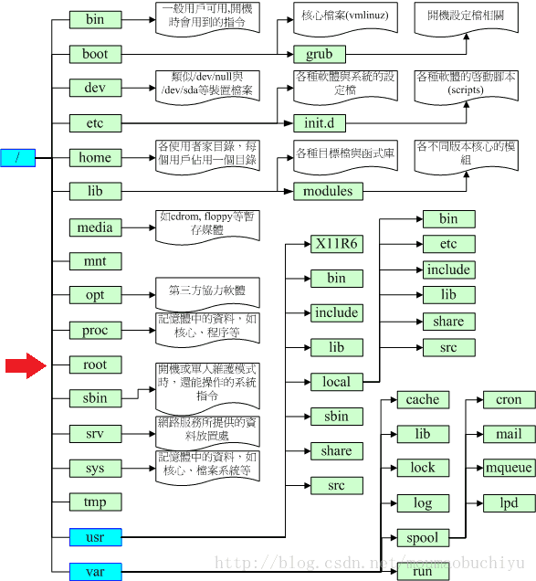

## 图解



<!-- more -->

## 环境变量配置

OS系统的配置文件加载顺序：

 1. /etc/profile
 2. /etc/paths
 3. ~/.bash_profile

/etc/profile、/etc/bashrc 是针对系统所有用户的 `全局变量`, 如修改需权限,
`~/.bash_profile` 是当前 `用户级` 的环境变量, 所以通常去修改它来设置环境变量.

操作步骤:

```
    1. 终端输入     vi ~/.bash_profile
    2. 设置        PATH：export PATH=/usr/local/mysql/bin:$PATH
    3. 输入        :wq
    4. 立即生效     source ~/.bash_profile
    5. 查看变量值   echo $PATH
```

注: `删除环境变量需重启shell才能立即生效`


## 开发相关文件

 - 应用程序(Applications)
 - 系统(System)
 - 用户(User)
 - 资料库(Library)


### 隐藏文件夹

| 文件夹          | 作用                                |
| --------------- | ----------------------------------- |
| usr             | unix 使用者专用文件夹               |
| bin             | unix 储存`基本指令`                 |
| sbin            | unix 储存`系统指令`                 |
| etc             | `系统设定` 储存位置                 |
| var             | `频繁改动` 置放于此, 如监控、日志等 |
| tmp             | 系统暂存档                          |
| `usr/local`     | 本地文件系统配置相关文件            |
| `usr/local/etc` | 相关配置文件                        |

### 其他

| 文件夹          | 作用                                                              |
| --------------- | ----------------------------------------------------------------- |
| `/`             | 磁盘根目录 也就是 `Macintosh HD` 目录下                           |
| `~ 或者 /User/` | 当前用户目录的顶级目录                                            |
| /user/Shared    | 目录可以被本地的所有用户访问                                      |
| Sites           | 用户个人站点网页文件。需设置 "系统预置->共享->Web共享" 中打开共享 |
| Public          | 可以把需要与其它用户共享的文件放在这个目录中                      |
