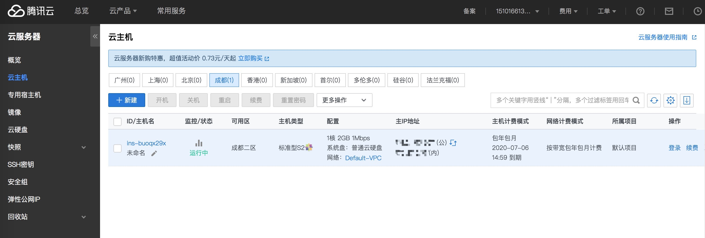
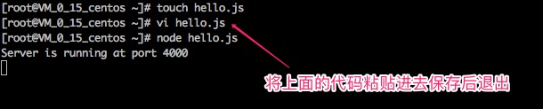
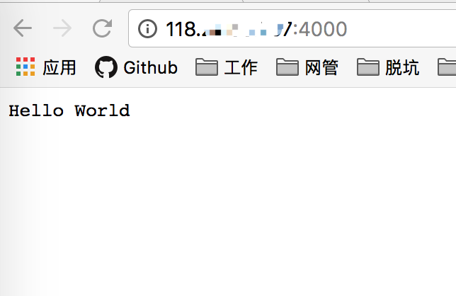
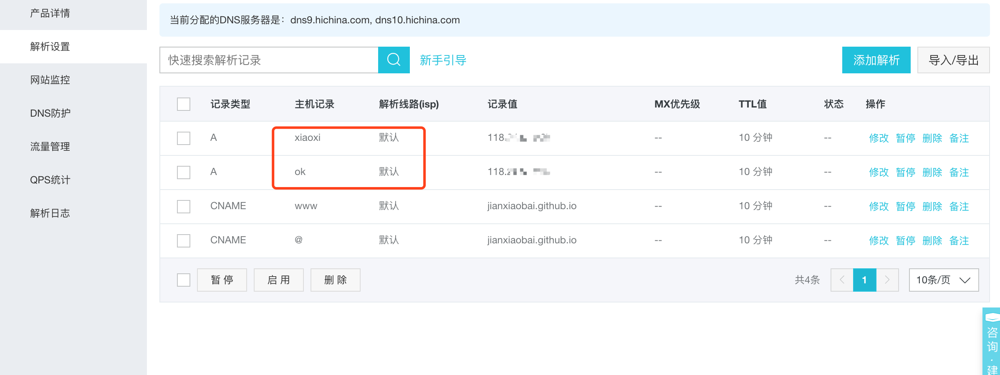

## 前言

就在前天，微信群里有人说腾讯云服务器搞活动 `1核2G 一个月10块钱`，
一起拼团的话还有优惠，我就心动了，一下续了二年的，
正好结合我所掌握的技术点，走通上线部署的流程，
不仅可以巩固我所掌握的知识点，也是让自己学的东西有个输出。

<!-- more -->

## 云服务器

我的云服务器主机 `centOS` 的基本配置



## 服务器登录

Mac 下可以使用自带的终端或者 `iTerm2` 通过命令方式进行登录

```
ssh root@<公网IP>
```

## 安装 Node 运行环境

用 nvm 来管理 node 版本：

```
curl -o- https://raw.githubusercontent.com/creationix/nvm/v0.33.0/install.sh | bash
```

安装 node：

```
nvm install v8.9.5
node -v
```

## 安装 cnpm

```
 npm install -g cnpm --registry=https://registry.npm.taobao.org
```

## 安装 git

```
yum install git
```

## 生成 ssh 秘钥

```
git config --global user.name "baixiaojian"
git config --global user.email "邮箱"

ssh-keygen -t rsa -C "邮箱"
```

## Hello world

```js
const http = require('http');
const server = http.createServer((req, res) => {
  res.statusCode = 200;
  res.setHeader('Content-Type', 'text/plain');
  res.end('Hello World\n');
});
server.listen(3000, () => {
  console.log(`Server is running at port 3000`);
});
```

在服务端执行：



在浏览器`中打开:



## 域名解析

虽然可以通过 IP 地址访问, 但是记忆起来比较困难, 可以通过`配置域名`来访问 node 应用。



我原本就有一个 `baixiaojian.com` 的域名,
所以我再次基础上配一个二级域名指向自己的主机,
如 `ok.baixiaojian.com`, 访问主机时 通过 nginx 反向代理到服务器指定端口应用,
这样的一个好处就是可以使 80 端口共用, `域名解析默认`是 80 端口, 如果不是 80 端口,
就需要指定端口号, 就像这样 `ok.baixiaojian.com:4000` 这样的体验是非常差的,
所以 nginx 使 80 端口可以共用是非常必要的。

[安装 nginx](http://www.baixiaojian.com/nginx/)
[配置 nginx](http://www.baixiaojian.com/nginx%E7%AC%94%E8%AE%B0/#more)

## Transmit

Transmit 是 Mac 下一款实用的 FTP 客户端软件，它使用起来非常的稳定，速度也比较理想。

[使用教程](https://www.hitnology.com/video-813.html)

## pm2 进程管理

[pm2 入门指南](http://www.cnblogs.com/chyingp/p/pm2-documentation.html)
